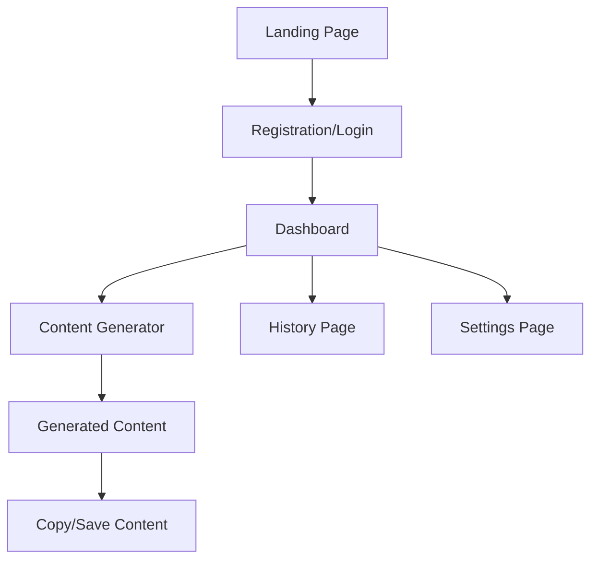

## 1. Product Overview
ContentAI is a SaaS platform that enables businesses to generate high-quality content instantly using AI technology. The platform helps marketers, entrepreneurs, and content creators save time by automating content creation for social media, websites, and advertising campaigns.

Target users include small business owners, marketing agencies, and content creators who need professional content without hiring expensive copywriters or spending hours writing themselves.

## 2. Core Features

### 2.1 User Roles
| Role | Registration Method | Core Permissions |
|------|---------------------|------------------|
| Free User | Email registration | 3 content generations per day, basic templates |
| Pro User | Subscription upgrade ($19/mo) | Unlimited generations, advanced templates, priority support |
| Business User | Subscription upgrade ($49/mo) | Unlimited generations, all templates, team collaboration, API access |

### 2.2 Feature Module
ContentAI requirements consist of the following main pages:
1. **Landing page**: hero section, feature showcase, pricing comparison, call-to-action.
2. **Dashboard**: sidebar navigation, user welcome, quick stats, recent activity overview.
3. **Content Generator**: content type selection, input form, generation results, save/copy functionality.

### 2.3 Page Details
| Page Name | Module Name | Feature description |
|-----------|-------------|---------------------|
| Landing page | Hero section | Display headline "Generate Perfect Content for Your Business in Seconds", subtitle, and CTA button with dark/purple gradient background |
| Landing page | Feature cards | Show 3 cards: Instagram Posts (social media content), Website Copy (landing page text), Ad Campaigns (advertising copy) with icons and descriptions |
| Landing page | Pricing section | Display 3 pricing tiers: Free (3 generations/day), Pro ($19/month), Business ($49/month) with feature comparison and upgrade buttons |
| Dashboard | Sidebar navigation | Include navigation links: Generate, History, Settings with active state indicators and user profile section |
| Dashboard | Welcome section | Display personalized greeting with user name, subscription status, and usage statistics |
| Content Generator | Content type selector | Allow users to choose between Instagram Posts, Website Copy, and Ad Campaigns with template previews |
| Content Generator | Input form | Provide fields for topic, tone, target audience, and any specific requirements with character limits |
| Content Generator | Results display | Show generated content in formatted text areas with copy-to-clipboard functionality and save options |

## 3. Core Process
**User Flow:**
1. User visits landing page and views features/pricing
2. User clicks "Get Started" and creates account
3. User is redirected to dashboard with welcome message
4. User clicks "Generate" in sidebar to access content generator
5. User selects content type and fills out form
6. User clicks "Generate" button to create content
7. User can copy, save, or regenerate content
8. User can view generation history in History section

## 4. User Interface Design

### 4.1 Design Style
- **Primary colors**: Deep purple (#6B46C1) to dark purple (#3730A3) gradient
- **Secondary colors**: White text on dark backgrounds, light gray for secondary text
- **Button style**: Rounded corners with gradient backgrounds, hover effects
- **Font**: Modern sans-serif (Inter or similar), 16px base size
- **Layout style**: Card-based design with subtle shadows and smooth animations
- **Icons**: Minimalist line icons, purple accent color

### 4.2 Page Design Overview
| Page Name | Module Name | UI Elements |
|-----------|-------------|-------------|
| Landing page | Hero section | Full-width gradient background (purple to dark purple), large headline text (48px), subtitle (20px), prominent CTA button with hover animation |
| Landing page | Feature cards | 3-column grid layout, white cards with purple accents, icon illustrations, 16px body text, consistent spacing (24px) |
| Landing page | Pricing section | 3-column pricing cards, highlighted Pro plan with "Popular" badge, clear pricing display, feature checklists, upgrade buttons |
| Dashboard | Sidebar | Dark sidebar (800px width), white text, purple active states, user avatar section at top, logout button at bottom |
| Dashboard | Main content | Light background, card-based layout for stats and recent activity, clean typography with proper hierarchy |
| Content Generator | Form section | Clean white cards, purple accent borders on focus, clear labels, textarea with character counter, prominent generate button |

### 4.3 Responsiveness
Desktop-first design approach with mobile responsiveness. Sidebar converts to hamburger menu on mobile, cards stack vertically, forms adapt to single column layout on smaller screens.