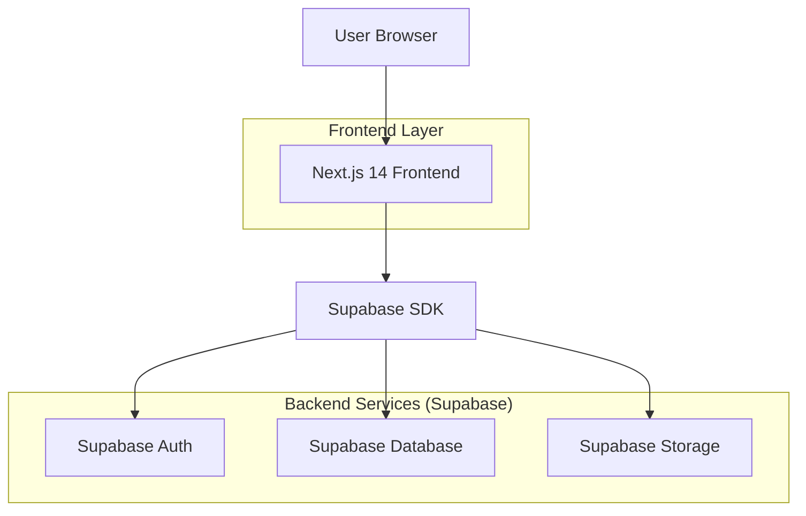
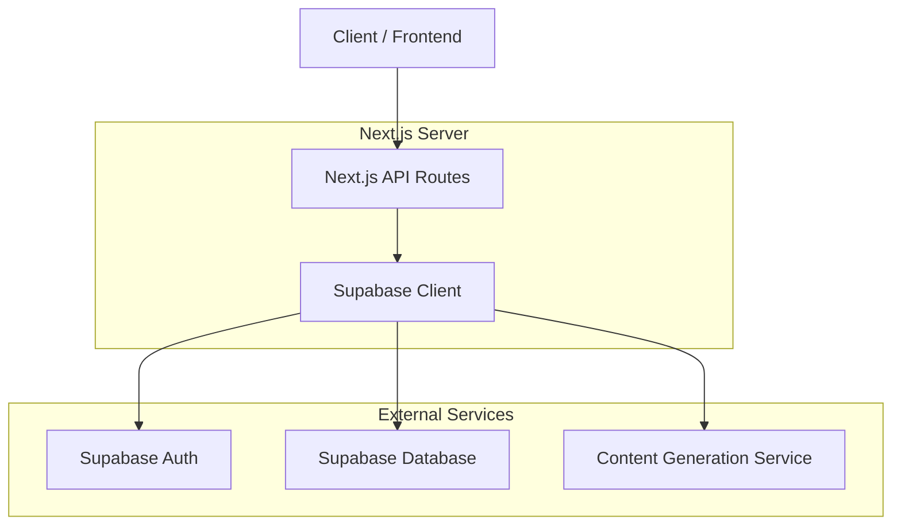
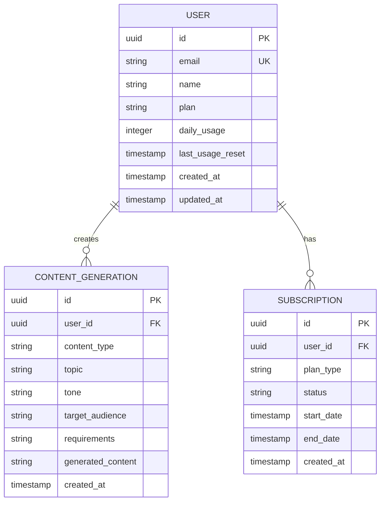

## 1. Architecture design



## 2. Technology Description
- **Frontend**: Next.js 14 (App Router) + TypeScript + Tailwind CSS
- **Initialization Tool**: create-next-app
- **Backend**: Supabase (BaaS)
- **Database**: Supabase PostgreSQL
- **Authentication**: Supabase Auth
- **Storage**: Supabase Storage (for user assets)

## 3. Route definitions
| Route | Purpose |
|-------|---------|
| / | Landing page with hero, features, and pricing |
| /auth/login | User login page |
| /auth/register | User registration page |
| /dashboard | Main dashboard with sidebar navigation |
| /dashboard/generate | Content generator form page |
| /dashboard/history | User's content generation history |
| /dashboard/settings | User account settings |

## 4. API definitions

### 4.1 Content Generation API
```
POST /api/generate-content
```

Request:
| Param Name | Param Type | isRequired | Description |
|------------|------------|-------------|-------------|
| content_type | string | true | Type of content: 'instagram', 'website', 'ads' |
| topic | string | true | Main topic for content generation |
| tone | string | true | Desired tone: 'professional', 'casual', 'persuasive' |
| target_audience | string | true | Target audience description |
| requirements | string | false | Additional requirements or constraints |

Response:
| Param Name | Param Type | Description |
|------------|-------------|-------------|
| success | boolean | Generation status |
| content | string | Generated content text |
| usage_count | number | Updated usage count for user |

Example:
```json
{
  "content_type": "instagram",
  "topic": "summer fashion trends",
  "tone": "casual",
  "target_audience": "young adults 18-25",
  "requirements": "include hashtags"
}
```

### 4.2 User Management API
```
GET /api/user/profile
PUT /api/user/profile
GET /api/user/usage
```

## 5. Server architecture diagram



## 6. Data model

### 6.1 Data model definition


### 6.2 Data Definition Language

User Table (users)
```sql
-- create table
CREATE TABLE users (
    id UUID PRIMARY KEY DEFAULT gen_random_uuid(),
    email VARCHAR(255) UNIQUE NOT NULL,
    name VARCHAR(100) NOT NULL,
    plan VARCHAR(20) DEFAULT 'free' CHECK (plan IN ('free', 'pro', 'business')),
    daily_usage INTEGER DEFAULT 0,
    last_usage_reset TIMESTAMP WITH TIME ZONE DEFAULT NOW(),
    created_at TIMESTAMP WITH TIME ZONE DEFAULT NOW(),
    updated_at TIMESTAMP WITH TIME ZONE DEFAULT NOW()
);

-- create index
CREATE INDEX idx_users_email ON users(email);
CREATE INDEX idx_users_plan ON users(plan);
```

Content Generation History Table (content_generations)
```sql
-- create table
CREATE TABLE content_generations (
    id UUID PRIMARY KEY DEFAULT gen_random_uuid(),
    user_id UUID NOT NULL REFERENCES users(id) ON DELETE CASCADE,
    content_type VARCHAR(50) NOT NULL CHECK (content_type IN ('instagram', 'website', 'ads')),
    topic VARCHAR(255) NOT NULL,
    tone VARCHAR(50) NOT NULL,
    target_audience TEXT NOT NULL,
    requirements TEXT,
    generated_content TEXT NOT NULL,
    created_at TIMESTAMP WITH TIME ZONE DEFAULT NOW()
);

-- create index
CREATE INDEX idx_content_generations_user_id ON content_generations(user_id);
CREATE INDEX idx_content_generations_created_at ON content_generations(created_at DESC);
CREATE INDEX idx_content_generations_type ON content_generations(content_type);
```

Subscription Table (subscriptions)
```sql
-- create table
CREATE TABLE subscriptions (
    id UUID PRIMARY KEY DEFAULT gen_random_uuid(),
    user_id UUID NOT NULL REFERENCES users(id) ON DELETE CASCADE,
    plan_type VARCHAR(20) NOT NULL CHECK (plan_type IN ('free', 'pro', 'business')),
    status VARCHAR(20) NOT NULL CHECK (status IN ('active', 'cancelled', 'expired')),
    start_date TIMESTAMP WITH TIME ZONE DEFAULT NOW(),
    end_date TIMESTAMP WITH TIME ZONE,
    created_at TIMESTAMP WITH TIME ZONE DEFAULT NOW()
);

-- create index
CREATE INDEX idx_subscriptions_user_id ON subscriptions(user_id);
CREATE INDEX idx_subscriptions_status ON subscriptions(status);
```

-- Row Level Security (RLS) policies
ALTER TABLE content_generations ENABLE ROW LEVEL SECURITY;
ALTER TABLE users ENABLE ROW LEVEL SECURITY;
ALTER TABLE subscriptions ENABLE ROW LEVEL SECURITY;

-- Grant permissions
GRANT SELECT ON users TO anon;
GRANT ALL PRIVILEGES ON users TO authenticated;
GRANT SELECT ON content_generations TO authenticated;
GRANT ALL PRIVILEGES ON content_generations TO authenticated;
GRANT SELECT ON subscriptions TO authenticated;
GRANT ALL PRIVILEGES ON subscriptions TO authenticated;